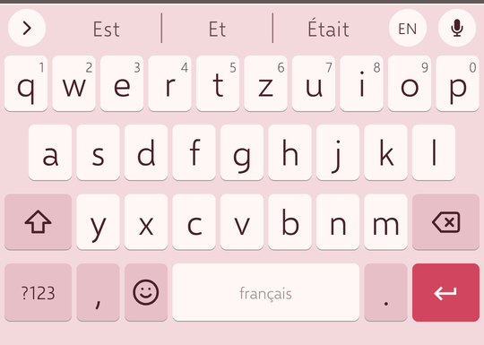
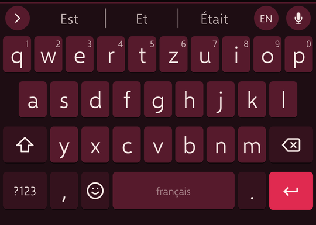
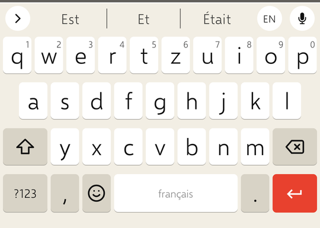
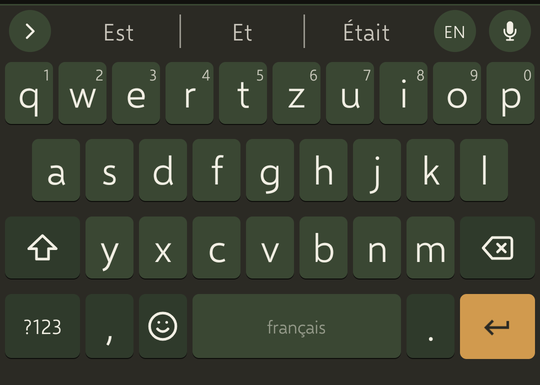
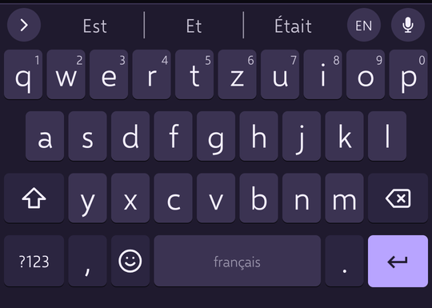
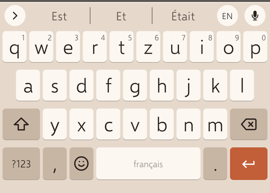

# Clavier Plume

Clavier Android français / anglais, hors ligne, sans publicité ni télémétrie, pensé d'abord
pour bien écrire le français. C'est une **version modifiée de [FUTO Keyboard](https://github.com/futo-org/android-keyboard)**.

## Ce qu'il fait de particulier

- **Élision juste** : `l'`, `d'`, `qu'`, `j'`, `n'`, `s'`… générées par la grammaire (catégorie,
  nombre, personne) et validées contre le dictionnaire Dicollecte, pas devinées : « l'hôtel »
  oui, « l'haricot » non, « j'aime » oui, « j'aimes » non.
- **Accents retrouvés** : « voila » → « voilà », « coeur » → « cœur », « aplus » → « à plus ».
- **Impératifs et inversions** : « rappelle-moi », « dépêche-toi », « allons-y », « a-t-il »,
  « avez-vous ».
- **Typographie** : apostrophe courbe, espaces insécables avant `; : ! ?`, guillemets « ».
- **Pas de majuscule après les abréviations** : « etc. », « cf. », « p. ex. », « M. » ; une URL ou une adresse e-mail n'est ni corrigée, ni coupée, ni capitalisée.
- **Deux langues, une touche** : la touche EN/FR bascule instantanément, la barre d'espace aussi
  par glissement. Par défaut les deux dictionnaires sont consultés en même temps (la langue dans
  laquelle vous écrivez l'emporte) ; après trois mots dans l'autre langue, la barre propose
  « Passer en anglais ? » d'un tap. Réglage « Une langue à la fois » dans Langues.
- **Vos mots** : importez une liste (texte, CSV, export Gboard, Hunspell, LibreOffice) dans le
  dictionnaire personnel ; un mot appris se garde pour de bon d'un tap (★).
- **Apprentissage prudent** : un mot inconnu n'est retenu qu'à sa troisième validation, un mot
  effacé au retour arrière est désappris, l'écran « Mots appris » permet d'oublier d'un geste.
- **Dictionnaire** : Lexique 3.83 (fréquences, catégories), noms propres et bigrammes du corpus
  de Leipzig, vocabulaire d'aujourd'hui de LanguageTool, vocabulaire passif du Littré (reconnu
  s'il est tapé, jamais proposé).
- **Réglages minimalistes** : 7 écrans, une trentaine d'options.
- **Dictée** hors ligne (Whisper, modèle multilingue embarqué), glissement, presse-papiers.
- **Treize thèmes** dont deux « encre » à fort contraste (Coquette, Militante, Torride, Nature
  depuis la 2.0.5), typographie Selawik.

Rien ne quitte l'appareil : aucune permission réseau n'est utilisée pour la saisie.

## Thèmes

| Plume Coquette | Plume Torride |
|---|---|
|  |  |

| Plume Militante | Plume Nature |
|---|---|
|  |  |

| Plume Lavande | Plume Terracotta |
|---|---|
|  |  |

## Installation

Téléchargez l'APK de la dernière [release](../../releases) et installez-la, ou suivez ce dépôt
avec [Obtainium](https://github.com/ImranR98/Obtainium). Puis Réglages Android → Langues et
saisie → activer « Clavier Plume ».

## Licence

Le code est sous [FUTO Source First License 1.1](LICENSE.md) : usage, modification et
redistribution libres à des fins **non commerciales**. Clavier Plume est une version modifiée
de FUTO Keyboard ; les modifications sont décrites dans [NOTICE-PLUME.md](NOTICE-PLUME.md),
avec les sources de données et leurs licences (Lexique CC BY-SA, Leipzig CC BY, Littré
CC BY-SA, LanguageTool LGPL, LibreOffice MPL, Selawik OFL).

## Compiler

```bash
git clone --recurse-submodules https://github.com/funkypitt/clavier-plume.git
cd clavier-plume
VERSION_CODE=1 VERSION_NAME=1.0.0 ./gradlew assemblePubliqueStableRelease
```

Les sous-modules (bibliothèques, traductions, thèmes, ressources, glissement) sont ceux de
FUTO Keyboard.

Le dictionnaire français `plume/res-large-overlay/raw/main_fr.dict` est généré par les outils du
projet (Lexique + règles d'élision + contrôle Dicollecte) ; il est fourni compilé.

---

*Clavier Plume is a French/English Android keyboard derived from FUTO Keyboard, focused on
correct French elision, accents and typography, with a bilingual toggle key and cautious word
learning. Non-commercial licence (FUTO Source First 1.1). Nothing leaves the device.*

## Crédits / Credits

Basé sur / Based on [FUTO Keyboard](https://github.com/futo-org/android-keyboard) by FUTO Holdings Inc.,
FUTO Source First License 1.1. Voir / see `NOTICE.md` et `NOTICE-PLUME.md`.

© 2026 Pierre Gallaz. Développé avec [Claude Code](https://claude.com/claude-code) (Anthropic).
Licence FUTO Source First 1.1, voir `LICENSE.md`.

© 2026 Pierre Gallaz. Developed with [Claude Code](https://claude.com/claude-code) (Anthropic).
FUTO Source First 1.1 licence, see `LICENSE.md`.
